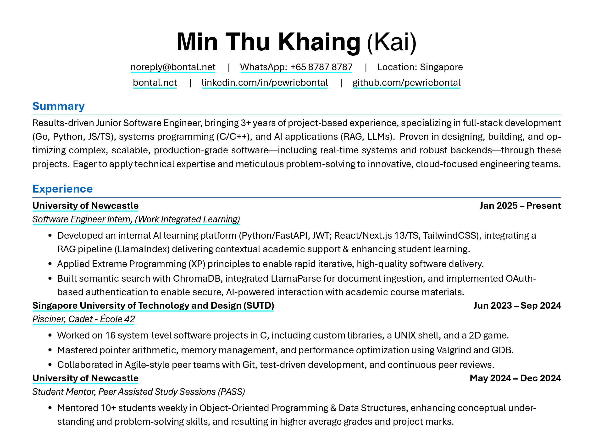

# Resume Builder by Kai.



A personal setup for maintaining my resume with Markdown and automatically generating a professionally formatted PDF using LaTeX.

## Overview

This repository contains the source files for my professional resume:

- Content is maintained in Markdown for easy editing (`resume.md`)
- LaTeX template for PDF generation (`resume-template.tex`)
- Automatic build and deployment through GitHub Actions
- Cross-platform compatibility with minimal dependencies

## Local Setup

### Prerequisites

- Make
- Pandoc
- XeLaTeX
- Microsoft fonts (for the Georgia font used in the template)

### Installation

#### Ubuntu/Debian
```bash
sudo apt-get update
sudo apt-get install -y texlive-xetex texlive-fonts-recommended texlive-fonts-extra pandoc ttf-mscorefonts-installer
sudo fc-cache -f -v
```

#### macOS
```bash
brew install pandoc
brew install --cask mactex-no-gui
```

#### openSUSE Tumbleweed/Leap
```bash
sudo zypper refresh
sudo zypper install texlive-xetex texlive-fonts-recommended texlive-fonts texlive-latex pandoc fetchmsttfonts
sudo fc-cache -f -v
```

#### Fedora/RHEL/CentOS
```bash
sudo dnf install texlive-xetex texlive-collection-fontsrecommended texlive-collection-fontsextra pandoc msttcorefonts
sudo fc-cache -f -v
```

#### Arch Linux
```bash
sudo pacman -Sy texlive-most pandoc
yay -S ttf-ms-fonts
sudo fc-cache -f -v
```

#### Windows
Install [MikTeX](https://miktex.org/download) and [Pandoc](https://pandoc.org/installing.html)

## Usage

### Building the Resume

```bash
# Generate PDF
make

# View the generated PDF
make view

# Check information about the output file
make info

# Clean temporary files
make clean
```

### File Structure

- `resume.md` - Main content file in YAML/Markdown format
- `resume-template.tex` - LaTeX template for PDF styling
- `Makefile` - Build automation
- `.github/workflows/workflow.yml` - CI/CD configuration

### Deployment

The GitHub Actions workflow automatically:
1. Compiles the resume on every push to master
2. Deploys the PDF to personal storage repository

## Customization

### Output Filename

The output filename is generated based on the name in `resume.md`:
```
FirstName_MiddleName_LastName_SWE.pdf
```

To change this format, modify the `OUTPUT` variable in the `Makefile`.

### LaTeX Template

The `resume-template.tex` file can be modified to adjust:
- Fonts and typography
- Colors and styling
- Layout and spacing
- Section organization

## Notes

This setup is primarily for personal use but might be helpful for others looking to maintain their resume in a similar manner. Feel free to adapt any part of it for your own needs.

PDF files are not tracked in this repository (see `.gitignore`).

---

Made with ❤️ by [Kai](https://bontal.net).